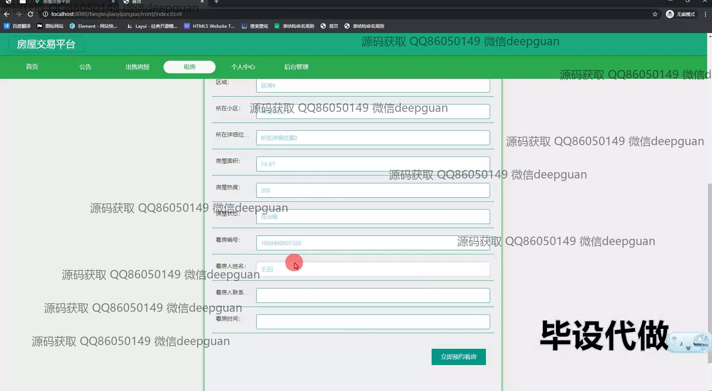
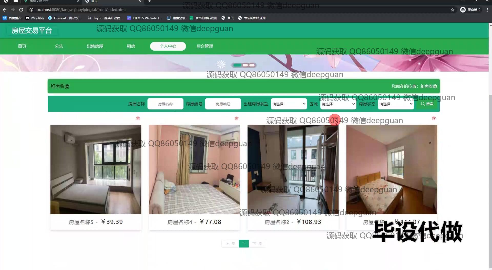
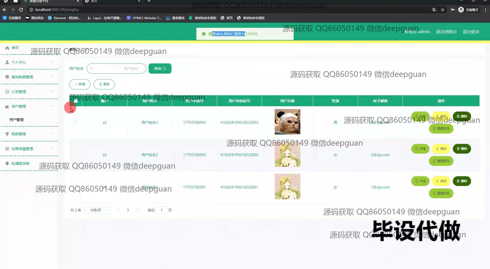

<h1 align="center">基于SpringBoot的房屋交易平台的设计与实现</h1>

## 简介
基于SpringBoot的房屋交易平台：角色分为管理员和用户；提供房源信息发布与管理、用户注册与管理、预约看房与审核、房屋搜索与筛选功能，简洁界面设计，提升用户交互体验。    --计算机毕业设计源码；毕设源码；java毕业设计源码

## 联系方式

<h3 align="center">获取完整代码与数据库文件 + 微信：deepguan QQ: 86050149 QQ群: 783742310</h3>

<h3 align="center">可帮忙远程部署 包运行成功！提供远程部署、修改代码、设计文档指导、代码讲解等服务！</h3>

## 功能介绍（完整见运行截图）
用户：基本功能包括注册、登录、退出，拥有主页导航、房屋信息发布、个人中心访问和收藏管理等权限。在主页上，可以使用筛选框查询房屋信息并查看详情。用户可发布出售信息，输入详细的房屋信息和联系方式，提交预约看房请求，并通过导航栏访问公告、租房等信息。后台管理功能允许用户查看个人资料和留言，提示不能预约看自己发布的房屋。在房源管理界面，可以筛选按类型、区域、面积等条件查看列表，进行详细和修改操作。  
管理员：负责平台的后台管理，包括公告管理、用户管理和房源管理等。公告管理涉及类型的添加、编辑、删除及公告信息展示。用户管理界面支持通过搜索栏查找用户信息，进行查看、修改、重置密码及删除操作。管理员可进行房屋交易信息审核，选择“通过”或“拒绝”并输入审核意见，管理房源的详细信息和状态更新。平台系统设计简洁，功能分类明了，支持筛选和快速处理。

## 运行截图

本代码来源于网络,仅供学习参考使用!

